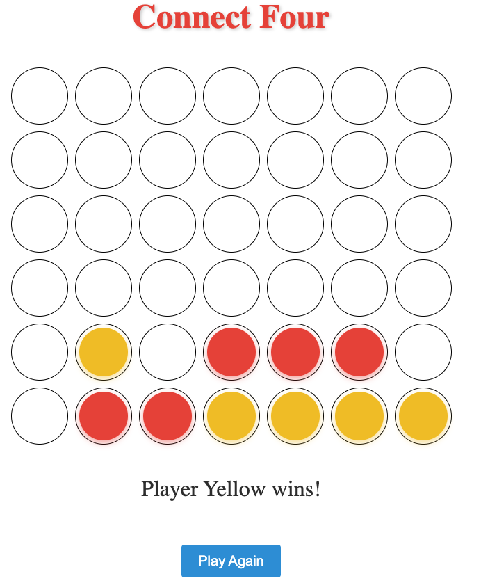

# ConnectFourGame

This project was generated with [Angular CLI](https://github.com/angular/angular-cli) version 16.1.3.

## Development server

To run the development server, follow these steps:

1. Make sure you have Node.js installed on your machine.
2. Open a terminal or command prompt and navigate to the project directory.
3. Run the command `npm install` to install the project dependencies.
4. Run the command `ng serve` to start the development server.
5. Open your web browser and navigate to `http://localhost:4200/`. The application will automatically reload if you change any of the source files.

## Code scaffolding

You can use Angular CLI to generate new components, directives, pipes, services, classes, guards, interfaces, enums, and modules. To generate a new component, follow these steps:

1. Open a terminal or command prompt and navigate to the project directory.
2. Run the command `ng generate component component-name` and replace `component-name` with the desired name for your component.
3. The new component files will be generated according to the Angular CLI conventions.

## Build

To build the project, follow these steps:

1. Open a terminal or command prompt and navigate to the project directory.
2. Run the command `ng build` to build the project.
3. The build artifacts will be stored in the `dist/` directory.

## Running unit tests

To execute the unit tests via Karma, follow these steps:

1. Open a terminal or command prompt and navigate to the project directory.
2. Run the command `ng test`.
3. The unit tests will be executed, and the results will be displayed in the terminal or command prompt.

## Running end-to-end tests

To execute the end-to-end tests via a platform of your choice, follow these steps:

1. Open a terminal or command prompt and navigate to the project directory.
2. Run the command `ng e2e`.
3. To use this command, you need to first add a package that implements end-to-end testing capabilities.

## Further help

To get more help on the Angular CLI use `ng help` or go check out the [Angular CLI Overview and Command Reference](https://angular.io/cli) page.
